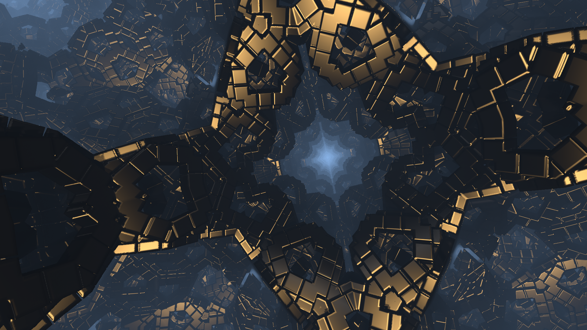

# Unity-Fractal-Study

The shader code is converted from Flythrough(https://www.shadertoy.com/view/XsKXzc) created by Shane on Shadertoy.

If you are looking for shaders that do Raymarch, Reflection, Fractal, Lighting, etc, this repo might be interesting.

Video on YouTube(https://youtu.be/6ONC8899wZA)